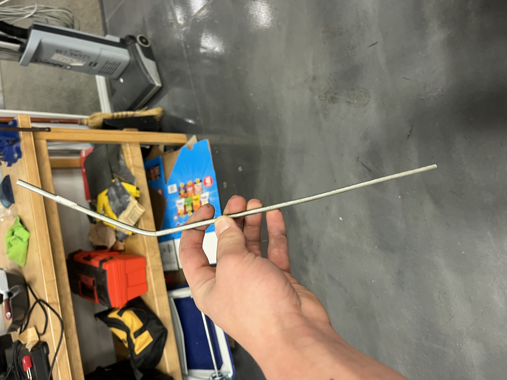

# The-Sykkle
World's best Stationary Bike KIT

Check out our [project proposal](https://docs.google.com/presentation/d/1oGuyexTfXZ76zOdR2cW2udPQ9dTwL28PTwHlfhq9di8/edit?usp=sharing)

## Bill of Materials

 - Raspberry Pi Pico
 - Jumper Wires
 - Accelerometer
 - LCD Display
 - Aluminum Sheets
 - 2x4 Wood Planks
 - 5nmm Openbuilds Aluminum X-rails
 - 5mm Openbuilds Bolts
 - 5mm Openbuilds T-slot nuts
 - Wood Screws
 - Metal Screws
 - 4-40 Nuts & Bolts

## Project Planning

As we started planning our project, we went through a couple ideas. Our first idea was the "Bike for a Coke" project. The presentation proposal for that project can be found [here](https://docs.google.com/presentation/d/1410jdZUBJ9_wcopdnr9YwcTXYcxyng96646APRgzr80/edit?usp=sharing)

Moving on, we decided to pivot the project to something less research heavy and more build/code intensive to better meet the requirements of the project. This is when we landed on our current project - the proposal is the first link in this repository. 

## Weekly Progress

Click here to see Weekly Progress

### Week 12

#### What we accompished/discovered

This week we focused on refining our design/sketches. We finished an onshape design for the main back piece of our project, as well as a prototype for the front piece. We also made sketches for these pieces which will act as a blue print once we start building. We also contacted our UVA Mentor, Nicholas, to schedule a meeting and mull over ideas. We decided the frame design we are going with, and our design for the front attatchment piece. 

One issue we've ran into is how we will secure the front wheel of our bike in a stable and efficent fasion. Originally we had the idea to use a spring powered snap fit device to hold in the wheel, but Mr. Miller helped us realize this wouldn't work well because any movement of the bike would destablilize this. We also thought about a screw powered tightening device, but this also seemed like excsessive hassle. We landed on a design involving a 3 3D printed piece's that will hold different bike tire sizes with a perepidicular wall that will have a slot for the bike wheels. 

One thing that went well was our brainstorming. We were able to finalize a desgin that will allow us to build our protoytype next week. We struggled with staying on task 100% of the time,

(Front Piece)

(Back Piece)

#### Future plans

Next week we plan to start building our prototype. We will build the frame of the back piece out of wood, 3D print the neccesary parts of the front piece, and then build the front pieces frame out of wood. We intend to finsish this intial protype next week, and move onto building the generator piece of our project. 

### Week 13

#### What we accompished/discovered

This week was solely spent on developing our protoype. We used our skethches and CAD design to guide us in building the back peice of the frame. We initially ran into problems getting the neccesary 45 degree angle, but with the help of the swiveling chop saw, we got it . We built each side of the back frame indiviudally, and added a middle suppot beam that wasn't in our drawings, because it needed significantly more support than we forsaw. Below is 1/2 of the frame we built.

One thing that went well was our building and improvising. We realized that there would be to much stress on the middle of our frame, and we quickly thought of and built an effective solution. One thing we could do better is efficent buidling.

(Back Frame)

#### Future plans

Next week we are going to assemble the back frame, and test it with the bike. Ideally we will also print out the front peice and start that construction. Our major goal is to have a finalized prototype before Christmas break. 

### Week 14

#### What we accompished/discovered

This week we initially focused on finalizing our back frame. Unfortuantately the bar that went through the back peice and the bike itself was made out of aluminum, and with testing, we discovered that it was not even close enough to strong enough. It bent in half as soon as I (Callan, heavier than Shrey) sat on the bike. This is not good as we want the bike to be able to hold someone up to 250 lbs, and I weight 175. To solve this problem, we went to Martins hardware and got a steel rod, that should be stronger. 

#### Future plans

Next week we plan to start building our prototype. We will build the frame of the back piece out of wood, 3D print the neccesary parts of the front piece, and then build the front pieces frame out of wood. We intend to finsish this intial protype next week, and move onto building the generator piece of our project. 

### Week 15

#### What we accompished/discovered

This week we initially focused on finalizing our back frame. Unfortuantately 

(Front Piece)

(Back Piece)

#### Future plans

Next week we plan to start building our prototype. We will build the frame of the back piece out of wood, 3D print the neccesary parts of the front piece, and then build the front pieces frame out of wood. We intend to finsish this intial protype next week, and move onto building the generator piece of our project. 

### 2/5 - 2/9

#### What we accomplished/discovered

This week was really work heavy. We both just kept working on the app and the frame for the bike. We did some weight testing on the steel rod we bought and it seems that it will be able to hold up. For the app, I referenced ChatGPT for some starter Xcode for bluetooth, but it really didn't get me anywhere. I was mainly just reasearching a lot on how to get bluetooth compatibility with my app. 

#### Future plans

Build is looking good for next week, and code has hiut a slight roadblock, but hopefully will recover soon. More work to come!

### 2/12 - 2/16

#### What we accomplished/discovered

This was a slighlty different weeks because we had french excahnge students, so we spent a little time off the project to show them around. On our block day, we both were absent so we weren't able to accomplish anything. On Thursday, we had a Zoom with Nicholas and talked about some problems I was having on the app development. He gave us some thoguhts and also sent a few links over that I could reference too. On Friday, we had an Aerospace Engineer talk to the class so once again, we weren't able to work on our project. 

#### Future plans

Unfortuneatly, this week was (almost) completely unproductive due to the events that came up throughout. Next week we hope to hit the ground running again and make some more progress on the bluetooth aspect of the app, along with a finalzed frame.

### 2/19 - 2/23

#### What we accomplished/discovered

This week on Tueday Nicholas came into the Lab to meet with us and discuss where we're at. On the code side, he ws able to help a lot with explaining how to progress with the app, and new ways to test it. I learned of some new sources and functions I could use (whic is iwhere I was struggling). I also learned that I could use my own iPhone to connect as the simulator on Xcode so I could actually test the bluetooth. For build, we did some weight testing on the new steel rod we got and our finished prototype...and it broke. So we decided that we'll try and suspend the bike from elsewhere rather than trying to sitch out the rod. 

#### Future plans

We need to keep working on our app and also find another way to suspend the bike. These would be the main goals for the upcoming weeks.

### 2/26 - 3/1

#### What we accomplished/discovered

This was a pretty good week in terms of what we accomplished. We found that supporting the bike on the rods around the wheels is much more structurally sound and reliable than our previous ideas. We decided to go with clamps to hold it out, and so we designed them in Onshape to be cut out of aluminum (water jet). I laser cut the pieces first to make sure that they fit how we want, and we'll get to the cutting next week. Unfortunately, our block day (in which we were going to waterjet and hopefully test some) got cut short due to an assembly so we had less time this week.

#### Future plans

We want to waterjet the clamps next week and figure out attachments. We also need to come up with a more structually sound prototype for the frame, for which we are considering the metal bars.

## Code

Click here to see Code BTS

### Planning

The code of the project will mainly revolve around the various sensors that we will attach to provide rider metrics. The key differential in our project will be our adaptable screen. Instead of adding a built-in screen to the bike, we will allow users to connect their phone through an app to the bike, allowing them to display all the rider metrics on their personal device for ease and cutting down costs of the bike.

#### Potential Materials

1. Raspberry Pi Pico
2. HC-05 Bluetooth Module
3. Phone + App (TBD)
4. Other sensors TBD

