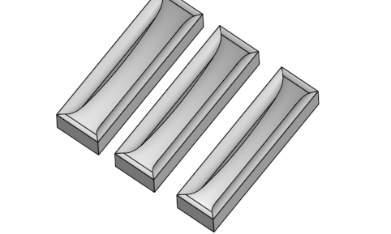
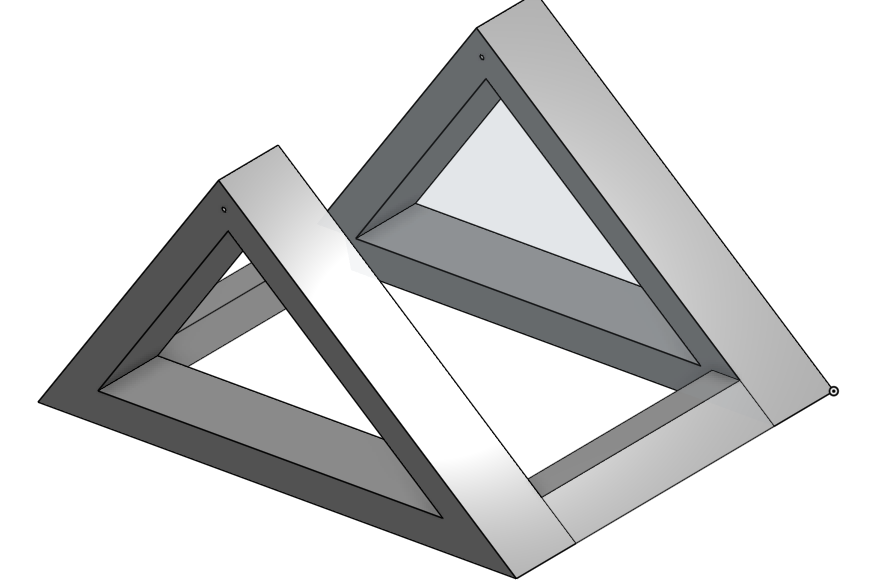

# The-Sykkle
World's best Stationary Bike KIT

## Weekly Progress

Click here to see Weekly Progress

### Week 12

#### What we accompished/discovered

This week we focused on refining our design/sketches. We finished an onshape design for the main back piece of our project, as well as a prototype for the front piece. We also made sketches for these pieces which will act as a blue print once we start building. We also contacted our UVA Mentor, Nicholas, to schedule a meeting and mull over ideas. We decided the frame design we are going with, and our design for the front attatchment piece. 

One issue we've ran into is how we will secure the front wheel of our bike in a stable and efficent fasion. Originally we had the idea to use a spring powered snap fit device to hold in the wheel, but Mr. Miller helped us realize this wouldn't work well because any movement of the bike would destablilize this. We also thought about a screw powered tightening device, but this also seemed like excsessive hassle. We landed on a design involving a 3 3D printed piece's that will hold different bike tire sizes with a perepidicular wall that will have a slot for the bike wheels. 

One thing that went well was our brainstorming. We were able to finalize a desgin that will allow us to build our protoytype next week. We struggled with staying on task 100% of the time,

(Front Piece)

(Back Piece)

#### Future plans

Next week we plan to start building our prototype. We will build the frame of the back piece out of wood, 3D print the neccesary parts of the front piece, and then build the front pieces frame out of wood. We intend to finsish this intial protype next week, and move onto building the generator piece of our project. 

### Week 13

#### What we accompished/discovered

This week was solely spent on developing our protoype. We used our skethches and CAD design to guide us in building the back peice of the frame. We initially ran into problems getting the neccesary 45 degree angle, but with the help of the swiveling chop saw, we got it . We built each side of the back frame indiviudally, and added a middle suppot beam that wasn't in our drawings, because it needed significantly more support than we forsaw. Below is 1/2 of the frame we built.

One thing that went well was our building and improvising. We realized that there would be to much stress on the middle of our frame, and we quickly thought of and built an effective solution. One thing we could do better is efficent buidling.

(Back Frame)

#### Future plans

Next week we are going to assemble the back frame, and test it with the bike. Ideally we will also print out the front peice and start that construction. Our major goal is to have a finalized prototype before Christmas break. 

### Week 14

#### What we accompished/discovered

This week we initially focused on finalizing our back frame. Unfortuantately 

(Front Piece)

(Back Piece)

#### Future plans

Next week we plan to start building our prototype. We will build the frame of the back piece out of wood, 3D print the neccesary parts of the front piece, and then build the front pieces frame out of wood. We intend to finsish this intial protype next week, and move onto building the generator piece of our project. 

